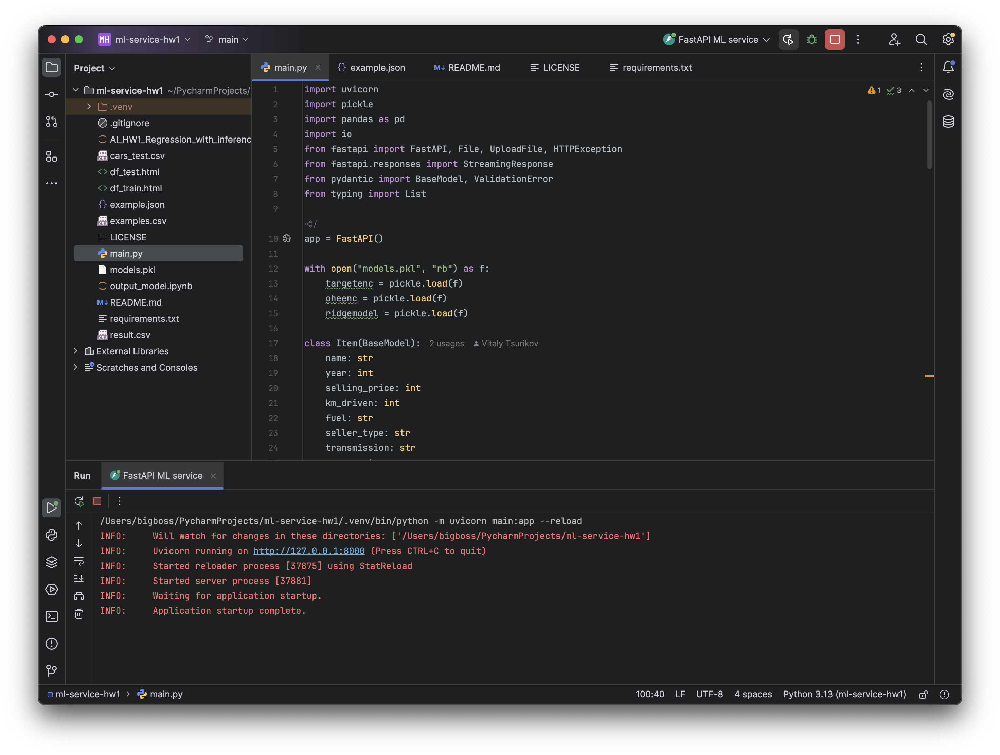
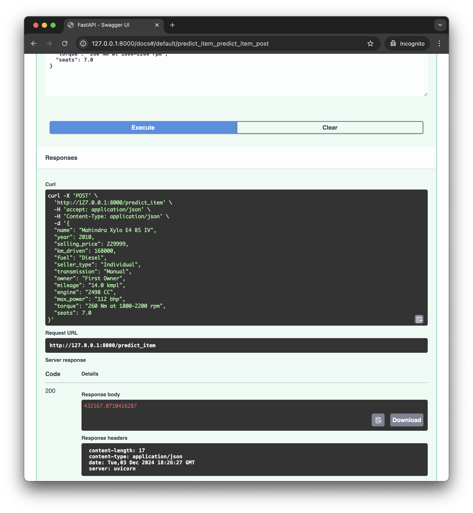
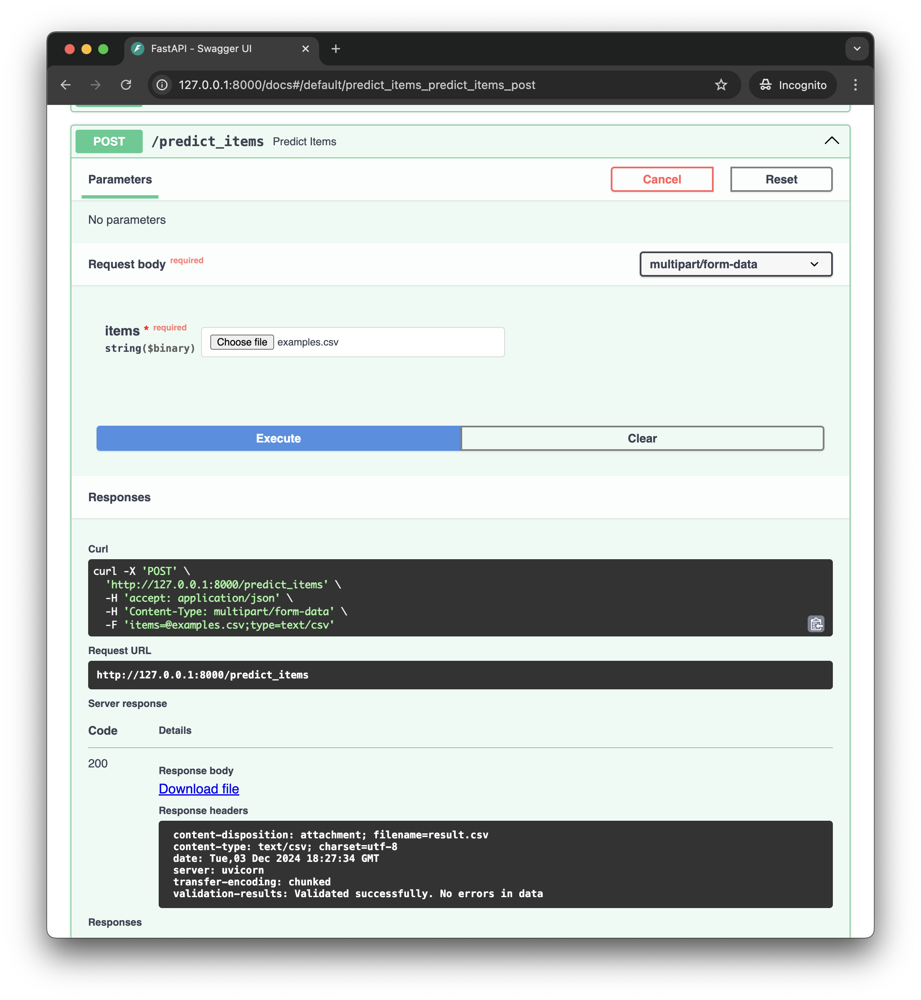
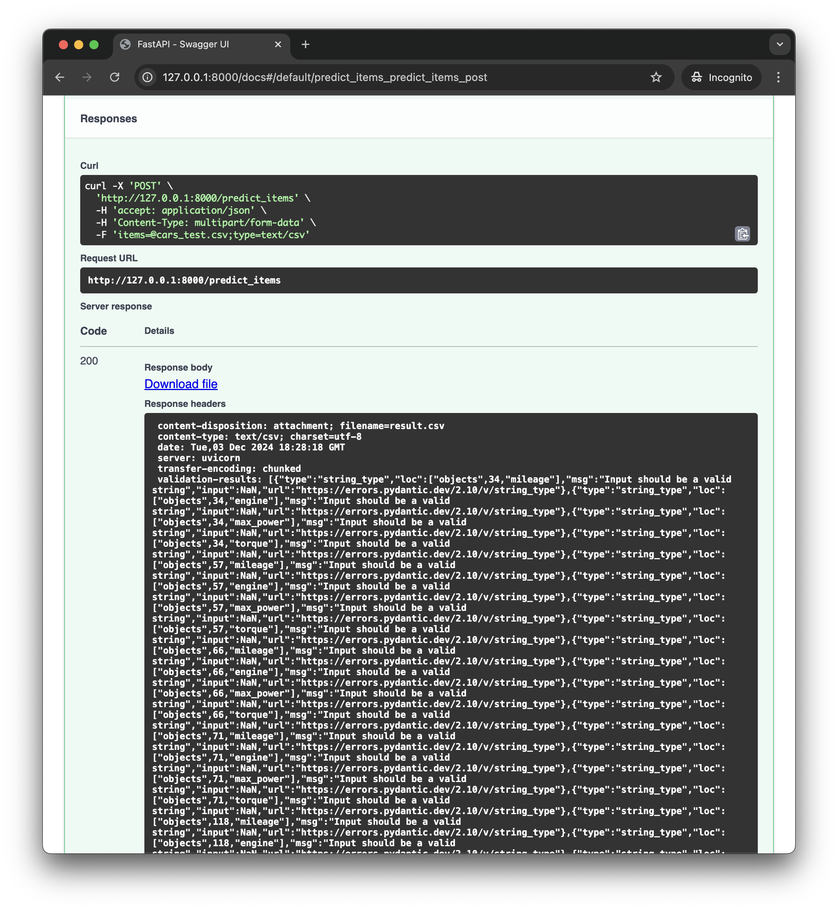

# HSE AI Master's ML course

Simple FastAPI service for car price prediction model

Student: Tsurikov Vitaly

## Examples of requests

* Uvicorn running server process

* 1 object from **example.json** prediction (/predict_item)

* .csv with multiple fully validated objects

* .csv with validation errors as JSON in response header

